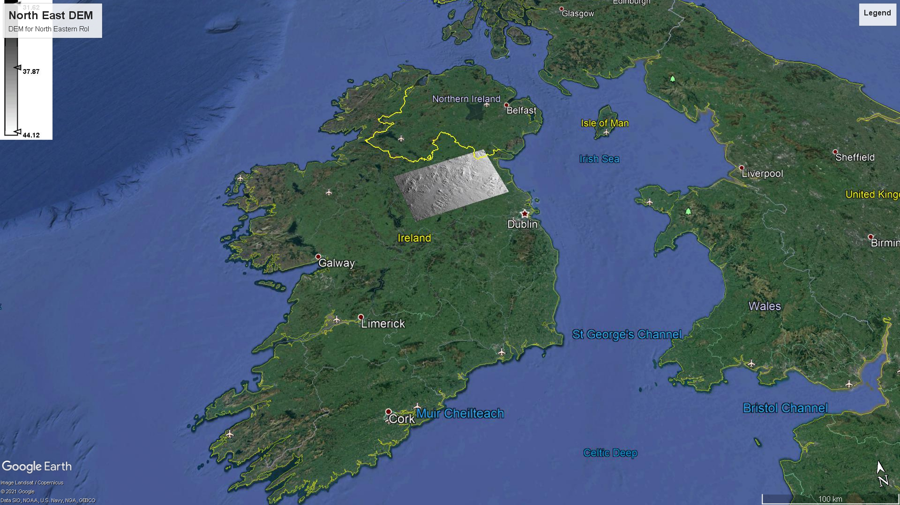
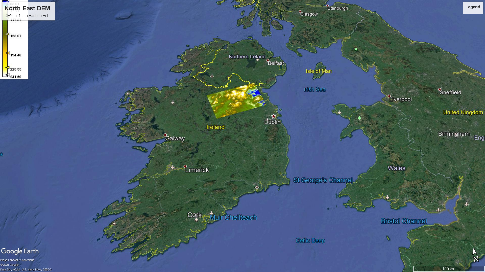
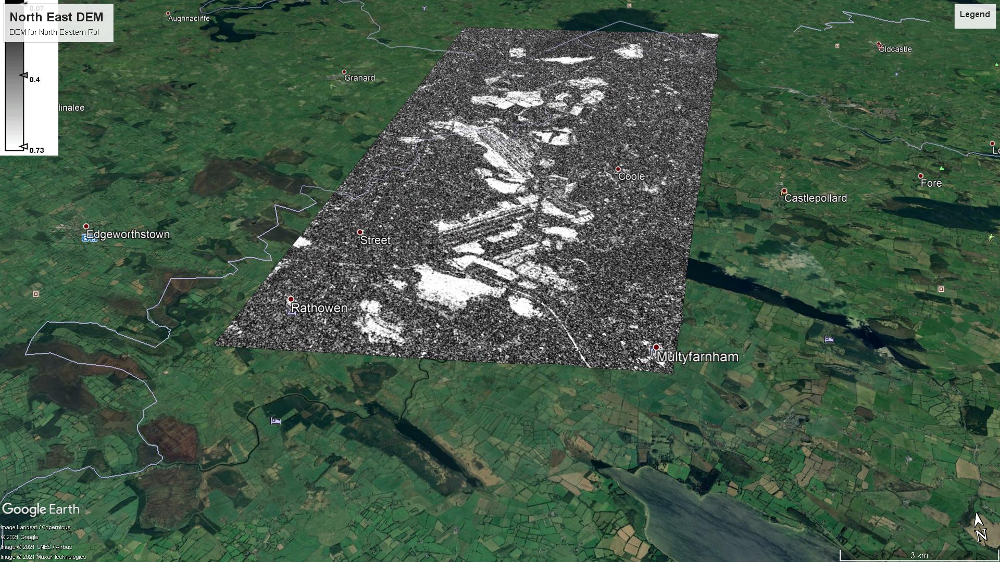
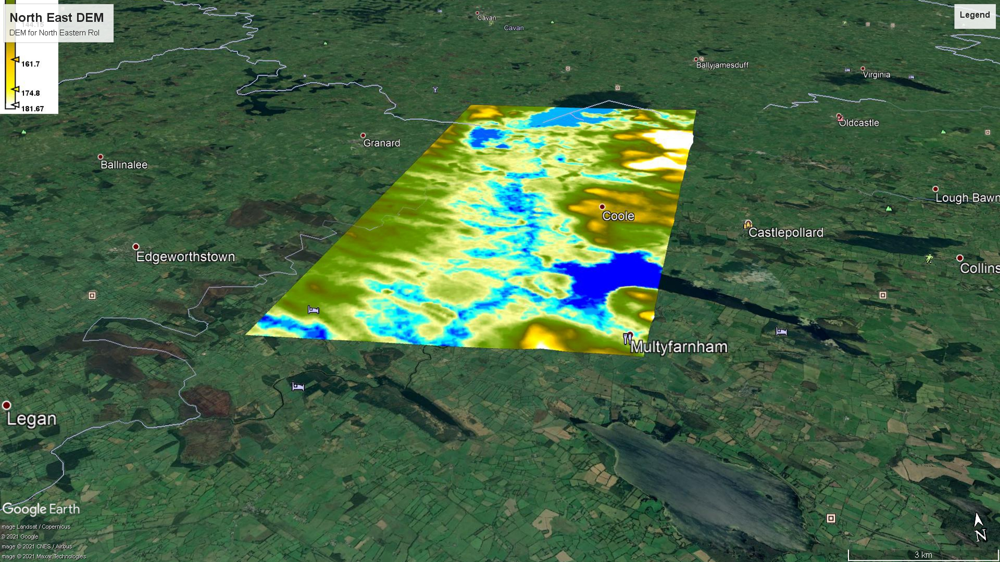

# DEM-Generation-and-Inteferomatric-Analysis-of-Behabane-Bog

This project aims to analyze displacement of an active bog between Sept 2015 and Sept 2020. 

Sept 2015 Data:
Inlination Angle North Eastern Rep. of Ireland.

Digital Elevation Map North Eastern Rep. of Ireland.

Coherence band for locality of Bohabane bog

Behabane Bog Digital Elevation Map

